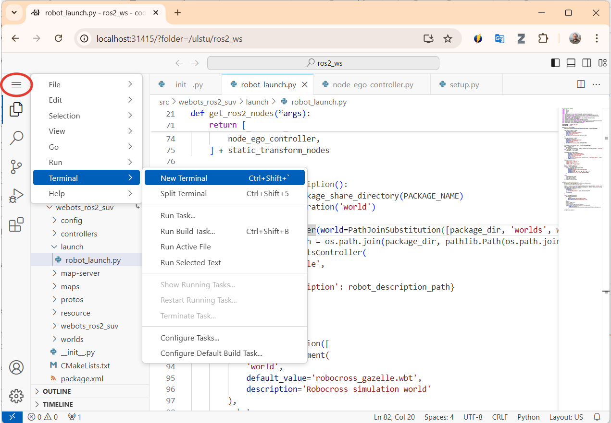

# Инструкция программиста по работе со виртуальным полигоном для разработки систем управления высокоавтоматизированных транспортных средств (ВАТС)

## Запуск решения

### Запуск Visual Studio

После того, как вы развернули Docker контейнер, необходимо запустить Visual Studio Code Server, в котором вы сможете редактировать исходные коды программ и запускать решение в симуляторе. ПОсле каждого запуска контейнера (после перезагрузки, например), необходимо на хостовой  машине (ваш основной компьютер) из рабочей папки проекта запустить команду в теминале:
Для Windows:
```bash
./run_windows.bat start-code-server
```

Для Linux:
```bash
make start-code-server
```
После запуска команды в любом браузере перейдите по ссылке [http://localhost:31420/?folder=/ulstu/ros2_ws](http://localhost:31420/?folder=/ulstu/ros2_ws), откроется окно редактора VS Code с исходными кодами программы


### Запуск решения в web-среде

Для того, чтобы в среде Visual Studio запустить терминал для запуска решения, необходимо открыть терминал .

В появившемся окне терминала необходимо выполнить команды для запуска:
1. Компиляцию проекта необходимо производить из папки `~/ros2_ws`. Если построение решения производить из другой папки, то все исполняемые файлы в папках `build` и `install` будут расположены в других директориях, и исполеямая среда ROS2 может их не распознать.

```bash
colcon build
```
Если в процессе работы над проектом вы столкнетесь с ситуацией, что вы изменили какие-то файлы, но поведение среды не изменилось, то попробуйте удалить папки `build` и `install` из директории `~/ros2_ws`. Иногда помогает.

2. Выполните команду `source` в папке `~/ros2_ws`, чтобы среда ROS2 узнала о всех ваших решениях и переменных среды. Эту команду необходимо выполнить после первой компиляции проекта, а также после того, как вы добавили новые файлы в проект. После изменения файлов и перекомпиляции проекта выполнять эту команду не обязательно:

```bash
source install/setup.bash
```

3. Запустите решение командой
```bash
ros2 launch ulstu_turtlebot robot_launch.py
```
Это стандартная команда по запуску решения в ROS2. `ulstu_turtlebot` - это наименование проекта, `robot_launch.py` - имя файла с логикой запуска, сам файл располагается в папке `projects/labs/ulstu_turtlebot/launch`. В launch файле прописываются ноды, которые необходимо запустить для ROS2, их параметры, также прописываются команды для запуска симулятора Webots.
Первый запуск может занять какое-то время, пока Webots загрузить необходимые элементы сцены из интернета. В этот момент в терминале выводится сообщение `The Webots simulation world is not yet ready, pending until loading is done...`.

Если через 1 минуту в теминале вы не увидели сообщения, что сцена готова `Controller successfully connected to robot in Webots simulation`, то запустите решение еще раз, такое бывает.

4. В окне браузера перейдите по ссылке [http://localhost:1111/index.html](http://localhost:1111/index.html) и на открывшейся странице нажмите кнопку `Connect`, откроется окно с симуляцией.

Управление просмотром сцены:
- Скроллинг колеса мыши - изменение масштаба сцены
- Перемещение указателя мыши с зажатой левой кнопкой мыши - вращение сцены
- Перемещение указателя мыши с зажатой левой кнопкой мыши - перемещение точки обзора

5. Для остановки решения в терминале VS Code нажмите `Ctrl+C`.

### Запуск решения оконного приложения

Решение можно запускать также в режиме, позволяющем открывать полноценное оконное приложение Webots со всеми его возможностями. Этот режим также позволяет запускать стандартные средства ROS2 (rviz  др), а также любые другие оконные приложения, установленные внутри docker-контейнера.

### Подготовка хостовой машины Windows

Для того, чтобы на вашей хостовой машине Windows отображались окна приложений, запущенных внутри docker контейнера, поставьте приложение XLaunch, входящее в состав утилит [VcXsrv](https://sourceforge.net/projects/vcxsrv/) и запустите его. При запуске все настройки оставьте по умолчанию, в предпоследнем диалоговом окне выберите галочку `Disable access control`. После нажатия кнопки `Готово` на последнем диалоговом окне окно настройки пропадет, а в панели уведомлений должен появиться новый значок запущенного приложения XLaunch.

### Подготовка хостовой машины Linux

На хостовой Linux машине выполните в терминале команду 'xhost +'.

### Запуск решения


Чтобы работало перенаправление окон из docker-контейнера в хостовую машину, необходимо закомментировать параметр `export WEBOTS_OFFSCREEN=1` в файле `~/.bashrc`, поаставив первым символом `#`. Это можно сделать встроенным редактором `nano`:
```bash
nano ~/.bashrc
```
Должно получиться так: 
```bash
# export WEBOTS_OFFSCREEN=1
```

После этого примените изменения командой
```bash
source ~/.bashrc
```

Еще лучше перезагрузить контейнер в терминале хостовой машины
```bash
docker restart ulstu-robotics-labs
```

Запуск решения можно производить из Web среды Visual Studio Code, как это было описано ранее, или непосредственно из терминала Linux. Для подключения к терминалу docker-контейнера, выполните команду в терминале хостовой машины:
```bash
docker exec -it ulstu-robotics-labs bash
```


## Разработка собственного объекта Node
В среде ROS2 управляющие программы для ВАТС организованы в виде объектов типа Node, представляющий собой в процессе запуска решения отдельные процессы, которые осуществляют [передачу сообщений](https://design.ros2.org/articles/intraprocess_communications.html) между собой посредством модели Publisher/Subscriber или RPC.

Для создания собственного объекта Node необходимо:
1. Добавить файл python в папку `webots_ros2_suv/webots_ros2_suv`, например `mynode_controller.py`.
2. Добавить класс, наследуемый от класса Node:
```python
class MyNode(Node):
    def __init__(self):
        try:
            super().__init__('mynode_controller')

        except  Exception as err:
            self._logger.error(''.join(traceback.TracebackException.from_exception(err).format()))

```
3. В этом файле определить точку входа, метод main:
```python
def main(args=None):
    try:
        rclpy.init(args=args)
        mynode_controller = MyNodeController()
        rclpy.spin(mynode_controller)
       rclpy.shutdown()
    except KeyboardInterrupt:
        print('server stopped cleanly')
    except  Exception as err:
        print(''.join(traceback.TracebackException.from_exception(err).format()))
    finally:
        rclpy.shutdown()
```

4. В файле `webots_ros2_suv/setup.py` изменить переменную `entry_points`, добавив описание нового класса MyNode по образцу:
```python
    entry_points={
        'console_scripts': [
            'node_sensors_webots = webots_ros2_suv.node_sensors_webots:main',
            'node_ego_controller = webots_ros2_suv.node_ego_controller:main',
            'mynode_controller = webots_ros2_suv.mynode_controller:main',
        ],
        'launch.frontend.launch_extension': ['launch_ros = launch_ros']
    }
```
5. Перекомпилируйте проект и обновите переменные окружения 
```bash
colcon build
source install/setup.bash
```
